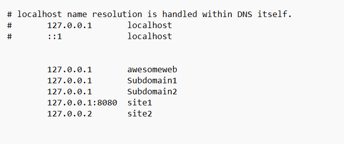

# Graded-Assignment-on-Networking-and-Servers

#Created custom local host domain Awsomeweb and also added the subdomains to it. 

1. Changed Nginx conf file as given below: 
 server {
         listen       80;
         server_name  site1;
      

        location / {
           root   C:/Users/Kaver/Downloads/nginx/nginx-1.24.0/awesomeweb;
           index  index.html;
         }
        }
        server {
         listen       80;
         server_name  Subdomain1;
      

        location / {
           root   html/Subdomain1;
           index  index.html;
         }

        }

          server {
         listen       80;
         server_name  Subdomain2;
      

        location / {
           root   html/Subdomain2;
           index  index.html;
         }

      }
     

2. Changed the local hosts file in Windows: c:\Windows\System32\Drivers\etc\hosts.

 	127.0.0.1       awesomeweb 
        127.0.0.1       Subdomain1
        127.0.0.1       Subdomain2

3. Added website file at the location mentioned in the Nginx Conf file.
4. started Nginx. 
5. Now, Awsome web can be accessed at http://awesomeweb/, and subdomains can be access at  http://Subdomain1 and http:Subdomain2

#python program writtern to check the status of the domain running which gives output in tabuler formate as given below: 
PS C:\Users\Kaver> & C:/Users/Kaver/AppData/Local/Microsoft/WindowsApps/python3.11.exe c:/Users/Kaver/Downloads/nginx/Subdomain_check.py
Checking subdomains...
+------------+--------+
| Subdomain  | Status |
+------------+--------+
| awesomeweb |  200   |
| subdomain1 |  200   |
| subdomain2 |  200   |
+------------+--------+
